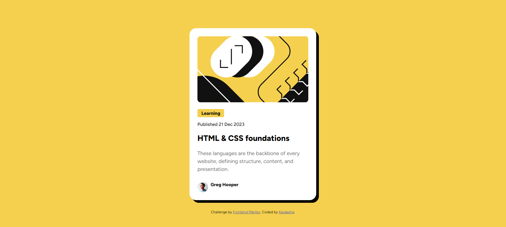

# Frontend Mentor - Blog preview card solution

This is a solution to the [Blog preview card challenge on Frontend Mentor](https://www.frontendmentor.io/challenges/blog-preview-card-ckPaj01IcS). Frontend Mentor challenges help you improve your coding skills by building realistic projects. 

## Table of contents

- [Overview](#overview)
  - [The challenge](#the-challenge)
  - [Screenshot](#screenshot)
  - [Links](#links)
- [My process](#my-process)
  - [Built with](#built-with)
  - [What I learned](#what-i-learned)
  - [Continued development](#continued-development)
- [Author](#author)

## Overview

### The challenge

Users should be able to:

- See hover and focus states for all interactive elements on the page

### Screenshot

### Links

- Solution URL: [https://github.com/kaveeshagim/blog-preview-card](https://github.com/kaveeshagim/blog-preview-card)
- Live Site URL: [https://kaveeshagim.github.io/blog-preview-card/](https://kaveeshagim.github.io/blog-preview-card/)

## My process

### Built with

- HTML5
- CSS custom properties
- Flexbox
- Mobile-first workflow

### What I learned

I learned how to use max height and width properties and how to use them. Using the gap property to space all the elements inside a component is an easy way to place all the different divs inside the main div
Also, referring the figma design helps immensely to write the perfect CSS. Visualizing the idea through a figma design is a crucial part before getting into the coding phase.

### Continued development

I want to focus more on using the flexbox properties.

## Author

- Github - [https://github.com/kaveeshagim](https://github.com/kaveeshagim)
- Frontend Mentor - [@kaveeshagim](https://www.frontendmentor.io/profile/kaveeshagim)
- Instagram - [@codingwcn](https://www.instagram.com/codingwcn)

